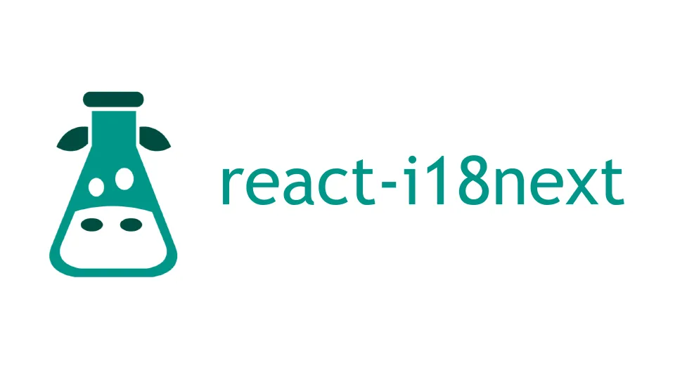

    
    <h1> React-TypeScript Internationalization app </h1>

This repository was created with the intention of providing developers with a
guide for creating scalable, multilingual applications with features like
dynamic language switching, localized date and time formatting, and RTL support.
Ideal for developers looking to implement robust internationalization solutions
in their React projects.

## Contributing

We welcome contributions from the developer community! Whether it's reporting
bugs, suggesting improvements, or submitting pull requests, your input is
invaluable to the success of this project. Please refer to the ⁠`CONTRIBUTING.md`
file for guidelines on how to contribute.
